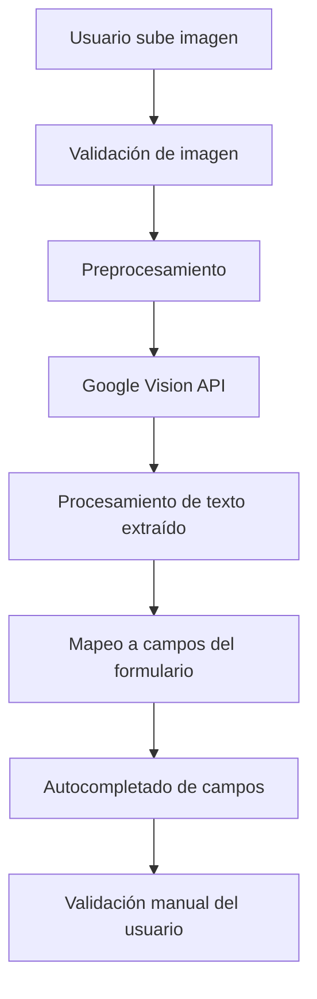

# 📋 PLAN DE IMPLEMENTACIÓN: ESCANEO OCR DE CARNET DE SEGURO

## 🎯 **OBJETIVO**
Permitir al usuario subir una foto del carnet de seguro del vehículo y extraer automáticamente la información para llenar los campos correspondientes en el formulario de registro de conductores.

---

## 🔄 **OPCIONES DE IMPLEMENTACIÓN**

### **Opción A: Google Cloud Vision API (Recomendada)**
- **Ventajas**: 
  - Mejor precisión (95%+)
  - Soporte para múltiples idiomas
  - Detección de estructura de documentos
  - API REST fácil de integrar
- **Desventajas**: 
  - Requiere API key
  - Costo por uso (aunque muy económico)
- **Costo estimado**: ~$1.50 por 1000 imágenes

### **Opción B: Tesseract.js (Cliente)**
- **Ventajas**: 
  - Completamente gratuito
  - Funciona offline
  - Sin dependencias externas
- **Desventajas**: 
  - Menor precisión (70-85%)
  - Más lento
  - Requiere preprocesamiento manual
- **Precisión**: Variable según calidad de imagen

---

## 🏗️ **ARQUITECTURA PROPUESTA (Google Vision API)**



---

## 📝 **PLAN DE IMPLEMENTACIÓN PASO A PASO**

### **FASE 1: Configuración inicial**

#### 1.1 Configurar Google Cloud Console
1. Crear proyecto en Google Cloud Console
2. Habilitar Vision API
3. Crear API key con restricciones:
   - Solo Vision API
   - Restricción por HTTP referrer (dominio de la app)
4. Configurar variables de entorno

#### 1.2 Variables de entorno (.env)
```env
VITE_GOOGLE_VISION_API_KEY=tu_api_key_aqui
VITE_GOOGLE_VISION_ENDPOINT=https://vision.googleapis.com/v1/images:annotate
```

#### 1.3 Instalar dependencias (opcional)
```bash
# Opción 1: Usar fetch directo (recomendado)
# No requiere instalación adicional

# Opción 2: SDK oficial
npm install @google-cloud/vision
```

### **FASE 2: Componente de carga de imagen**

#### 2.1 Crear componente `InsuranceCardScanner.tsx`
```typescript
interface InsuranceCardScannerProps {
  onInfoExtracted: (info: InsuranceInfo) => void;
  onError: (error: string) => void;
}

const InsuranceCardScanner: React.FC<InsuranceCardScannerProps>
```

#### 2.2 Funcionalidades del componente
- Área de drag & drop para imagen
- Botón para tomar foto (móvil)
- Preview de la imagen cargada
- Estados de carga, éxito y error
- Botón "Reintentar escaneo"

#### 2.3 Validaciones de imagen
- Formatos permitidos: JPG, PNG, WEBP
- Tamaño máximo: 5MB
- Dimensiones mínimas: 800x600px para mejor OCR
- Validación de aspect ratio

### **FASE 3: Servicio OCR**

#### 3.1 Crear `insuranceOcrService.ts`
```typescript
interface InsuranceInfo {
  company: string;
  policyNumber: string;
  expiryDate: string;
  coverageType: string;
  vehiclePlate?: string;
  confidence: number;
}

class InsuranceOcrService {
  async extractInsuranceInfo(imageFile: File): Promise<InsuranceInfo>
  private preprocessImage(file: File): Promise<string>
  private callGoogleVisionAPI(base64Image: string): Promise<string>
  private parseInsuranceText(text: string): InsuranceInfo
  private validateExtractedInfo(info: InsuranceInfo): boolean
}
```

#### 3.2 Implementación de métodos principales
```typescript
// Preprocesamiento de imagen
private async preprocessImage(file: File): Promise<string> {
  return new Promise((resolve) => {
    const canvas = document.createElement('canvas');
    const ctx = canvas.getContext('2d');
    const img = new Image();
    
    img.onload = () => {
      // Redimensionar si es necesario
      // Mejorar contraste
      // Convertir a base64
      resolve(canvas.toDataURL('image/jpeg', 0.8));
    };
    
    img.src = URL.createObjectURL(file);
  });
}

// Llamada a Google Vision API
private async callGoogleVisionAPI(base64Image: string): Promise<string> {
  const response = await fetch(
    `${import.meta.env.VITE_GOOGLE_VISION_ENDPOINT}?key=${import.meta.env.VITE_GOOGLE_VISION_API_KEY}`,
    {
      method: 'POST',
      headers: { 'Content-Type': 'application/json' },
      body: JSON.stringify({
        requests: [{
          image: { content: base64Image.split(',')[1] },
          features: [{ type: 'TEXT_DETECTION', maxResults: 1 }]
        }]
      })
    }
  );
  
  const data = await response.json();
  return data.responses[0]?.textAnnotations[0]?.description || '';
}
```

### **FASE 4: Procesamiento inteligente**

#### 4.1 Patrones de reconocimiento (`insurancePatterns.ts`)
```typescript
export const INSURANCE_PATTERNS = {
  // Números de póliza (diferentes formatos)
  policyNumber: [
    /(?:policy|póliza|no\.?)\s*:?\s*([A-Z0-9-]{6,20})/i,
    /([A-Z]{2,4}\d{6,12})/g,
    /(\d{10,15})/g
  ],
  
  // Fechas de vencimiento
  expiryDate: [
    /(?:expir|venc|valid)\w*\s*:?\s*(\d{1,2}[\/\-]\d{1,2}[\/\-]\d{2,4})/i,
    /(\d{1,2}[\/\-]\d{1,2}[\/\-]\d{4})/g
  ],
  
  // Compañías de seguro conocidas en Venezuela
  companies: [
    'MAPFRE',
    'AXA',
    'SEGUROS VENEZUELA',
    'BANESCO SEGUROS',
    'PROVINCIAL',
    'MERCANTIL SEGUROS',
    'SEGUROS UNIVERSITAS',
    'SEGUROS CARACAS'
  ],
  
  // Tipos de cobertura
  coverageTypes: [
    'TODO RIESGO',
    'RESPONSABILIDAD CIVIL',
    'DAÑOS A TERCEROS',
    'PÉRDIDA TOTAL',
    'ROBO Y HURTO'
  ]
};
```

#### 4.2 Algoritmo de mapeo inteligente
```typescript
private parseInsuranceText(text: string): InsuranceInfo {
  const lines = text.split('\n').map(line => line.trim());
  
  return {
    company: this.extractCompany(lines),
    policyNumber: this.extractPolicyNumber(lines),
    expiryDate: this.extractExpiryDate(lines),
    coverageType: this.extractCoverageType(lines),
    confidence: this.calculateConfidence(extractedData)
  };
}

private extractCompany(lines: string[]): string {
  for (const line of lines) {
    for (const company of INSURANCE_PATTERNS.companies) {
      if (line.toUpperCase().includes(company)) {
        return company;
      }
    }
  }
  return '';
}
```

### **FASE 5: Integración en formulario**

#### 5.1 Modificar `NuevoConductorForm` interface
```typescript
interface NuevoConductorForm {
  // ... campos existentes
  insurance_company: string;
  insurance_policy: string;
  insurance_expiry: string;
  insurance_type: string;
  insurance_auto_filled: boolean; // Flag para indicar si fue autocompletado
}
```

#### 5.2 Estados adicionales en componente
```typescript
const [insuranceScanning, setInsuranceScanning] = useState(false);
const [insuranceAutoFilled, setInsuranceAutoFilled] = useState(false);
const [insuranceConfidence, setInsuranceConfidence] = useState(0);
```

#### 5.3 Handler para información extraída
```typescript
const handleInsuranceInfoExtracted = (info: InsuranceInfo) => {
  setNuevoConductor(prev => ({
    ...prev,
    insurance_company: info.company,
    insurance_policy: info.policyNumber,
    insurance_expiry: info.expiryDate,
    insurance_type: info.coverageType,
    insurance_auto_filled: true
  }));
  
  setInsuranceAutoFilled(true);
  setInsuranceConfidence(info.confidence);
  
  // Mostrar notificación de éxito
  setNotificacion({
    open: true,
    mensaje: `Información extraída (${Math.round(info.confidence * 100)}% confianza)`,
    tipo: 'success'
  });
};
```

---

## 🎨 **DISEÑO DE INTERFAZ**

### **Sección de Seguro en el Modal**
```
┌─────────────────────────────────────┐
│ 🛡️ Información del Seguro           │
├─────────────────────────────────────┤
│ [📷 Escanear Carnet] [📁 Subir]    │
│                                     │
│ ┌─────────────────────────────────┐ │
│ │     [Área de imagen]            │ │
│ │   Arrastra aquí tu carnet       │ │
│ │      o haz clic para subir      │ │
│ │                                 │ │
│ │  [Estado: Escaneando... 🔄]     │ │
│ └─────────────────────────────────┘ │
│                                     │
│ Compañía: [MAPFRE ✅] (Auto)       │
│ Póliza:   [ABC123456 ✅] (Auto)    │
│ Vence:    [31/12/2024 ✅] (Auto)   │
│ Tipo:     [Todo Riesgo ✅] (Auto)  │
│                                     │
│ ✅ = Detectado automáticamente       │
│ [🔄 Reintentar] [✏️ Editar manual] │
└─────────────────────────────────────┘
```

### **Estados visuales**
- **Sin escanear**: Campos vacíos, área de upload visible
- **Escaneando**: Loading spinner, campos deshabilitados
- **Éxito**: Campos llenos con indicador verde y "Auto"
- **Error**: Mensaje de error, opción de reintento
- **Editando**: Campos habilitados para corrección manual

---

## 🔧 **ESTRUCTURA DE ARCHIVOS**

```
src/
├── components/
│   └── insurance/
│       ├── InsuranceCardScanner.tsx     # Componente principal
│       ├── ImagePreprocessor.tsx        # Preprocesamiento de imagen
│       ├── InsuranceFieldsDisplay.tsx   # Mostrar campos extraídos
│       └── ScanResultsReview.tsx        # Revisar resultados
├── services/
│   ├── insuranceOcrService.ts           # Servicio principal OCR
│   └── imageProcessingService.ts        # Utilidades de imagen
├── utils/
│   ├── insurancePatterns.ts             # Patrones de reconocimiento
│   ├── dateUtils.ts                     # Utilidades de fecha
│   └── confidenceCalculator.ts          # Cálculo de confianza
└── types/
    └── insurance.ts                     # Tipos TypeScript
```

---

## 📊 **CAMPOS A EXTRAER**

### **Información Principal**
1. **Compañía de Seguro** 
   - Ubicación: Parte superior del carnet
   - Patrones: Nombres conocidos de aseguradoras
   - Validación: Lista de compañías registradas

2. **Número de Póliza**
   - Formato: Alfanumérico (6-20 caracteres)
   - Patrones: ABC123456, 1234567890, POL-ABC-123
   - Validación: Formato y longitud

3. **Fecha de Vencimiento**
   - Formatos: DD/MM/YYYY, DD-MM-YYYY
   - Validación: Fecha futura válida
   - Conversión: Normalizar a formato ISO

4. **Tipo de Cobertura**
   - Opciones: Todo Riesgo, RC, Daños a Terceros
   - Detección: Palabras clave específicas
   - Mapeo: A valores estándar del sistema

5. **Placa del Vehículo** (opcional)
   - Para validación cruzada
   - Formato: ABC123 o AB1234
   - Verificación: Coincidencia con campo de vehículo

---

## ⚡ **FLUJO DE USUARIO DETALLADO**

### **Flujo Feliz (Happy Path)**
1. Usuario abre modal de registro de conductor
2. Navega a sección "Información del Seguro"
3. Hace clic en "Escanear Carnet"
4. Selecciona imagen desde galería o toma foto nueva
5. Sistema valida imagen (formato, tamaño, calidad)
6. Muestra preview y estado "Escaneando..."
7. OCR procesa imagen y extrae texto
8. Algoritmo mapea texto a campos específicos
9. Campos se llenan automáticamente con indicadores verdes
10. Usuario revisa información extraída
11. Opcionalmente edita campos si hay errores
12. Continúa con resto del formulario
13. Completa registro exitosamente

### **Flujos de Error**
- **Imagen de mala calidad**: Sugerir retomar foto
- **No se detecta texto**: Opción de entrada manual
- **Información incompleta**: Llenar campos detectados, solicitar completar manualmente
- **Error de API**: Fallback a entrada manual con mensaje explicativo

---

## 🚀 **VENTAJAS DE ESTA IMPLEMENTACIÓN**

### **Para el Usuario**
- ⏱️ **Ahorro de tiempo**: Reduce entrada manual de 2-3 minutos a 30 segundos
- 🎯 **Menos errores**: Evita errores de transcripción manual
- 📱 **Experiencia moderna**: Similar a apps bancarias y fintech
- ✅ **Flexibilidad**: Permite corrección manual si es necesario

### **Para el Sistema**
- 📊 **Datos más precisos**: Menor probabilidad de errores de entrada
- 🔄 **Proceso más rápido**: Acelera el registro de conductores
- 📈 **Escalabilidad**: Fácil agregar más tipos de documentos
- 🛡️ **Validación automática**: Verificación cruzada de información

### **Para el Negocio**
- 💰 **Reducción de costos**: Menos tiempo de soporte por errores
- 📈 **Mejor conversión**: Menos abandono en formularios largos
- 🏆 **Diferenciación**: Característica innovadora vs competencia
- 📊 **Analytics**: Métricas de uso y efectividad del OCR

---

## 📈 **MÉTRICAS DE ÉXITO**

### **Técnicas**
- **Precisión OCR**: >85% de campos correctos
- **Tiempo de procesamiento**: <10 segundos
- **Tasa de éxito**: >90% de imágenes procesadas
- **Confianza promedio**: >75%

### **UX/Negocio**
- **Tiempo de formulario**: Reducción de 50%
- **Tasa de abandono**: Reducción de 30%
- **Satisfacción usuario**: >4.5/5 en encuestas
- **Adopción**: >70% de usuarios usan OCR vs manual

---

## 🔮 **FUTURAS MEJORAS**

### **Fase 2: Mejoras avanzadas**
- **ML personalizado**: Entrenar modelo específico para carnets locales
- **Múltiples documentos**: Licencia de conducir, cédula, etc.
- **Validación en tiempo real**: Verificar pólizas con aseguradoras
- **OCR offline**: Implementar Tesseract.js como fallback

### **Fase 3: Integración avanzada**
- **API de seguros**: Integración directa con aseguradoras
- **Blockchain**: Verificación inmutable de documentos
- **IA predictiva**: Sugerir información basada en patrones
- **Realidad aumentada**: Guías visuales para mejor captura

---

## 🛠️ **CONSIDERACIONES TÉCNICAS**

### **Seguridad**
- API key con restricciones de dominio
- No almacenar imágenes en servidor
- Encriptar datos sensibles en tránsito
- Logs de auditoría para uso de OCR

### **Performance**
- Compresión de imagen antes de envío
- Cache de resultados por sesión
- Lazy loading del componente OCR
- Optimización de bundle size

### **Compatibilidad**
- Soporte para todos los navegadores modernos
- Fallback para navegadores sin soporte de cámara
- Responsive design para móvil y desktop
- Accesibilidad (ARIA labels, keyboard navigation)

---

## 📋 **CHECKLIST DE IMPLEMENTACIÓN**

### **Configuración**
- [ ] Crear proyecto en Google Cloud Console
- [ ] Habilitar Vision API
- [ ] Configurar API key con restricciones
- [ ] Agregar variables de entorno
- [ ] Configurar CORS si es necesario

### **Desarrollo**
- [ ] Crear servicio OCR base
- [ ] Implementar componente de scanner
- [ ] Agregar patrones de reconocimiento
- [ ] Integrar en formulario de conductor
- [ ] Agregar validaciones y manejo de errores
- [ ] Implementar estados de loading/éxito/error

### **Testing**
- [ ] Probar con diferentes tipos de carnets
- [ ] Validar en diferentes dispositivos
- [ ] Testing de performance con imágenes grandes
- [ ] Pruebas de accesibilidad
- [ ] Testing de casos edge (imagen borrosa, etc.)

### **Documentación**
- [ ] Documentar API del servicio
- [ ] Crear guía de usuario
- [ ] Documentar patrones de reconocimiento
- [ ] Manual de troubleshooting

---

## 📞 **CONTACTO Y SOPORTE**

Para dudas sobre la implementación:
- **Documentación técnica**: Este archivo
- **Patrones de reconocimiento**: `src/utils/insurancePatterns.ts`
- **Ejemplos de uso**: Componente `InsuranceCardScanner`
- **Testing**: Casos de prueba en `/tests/insurance-ocr/`

---

*Documento creado: [Fecha actual]*  
*Última actualización: [Fecha de modificación]*  
*Versión: 1.0* 