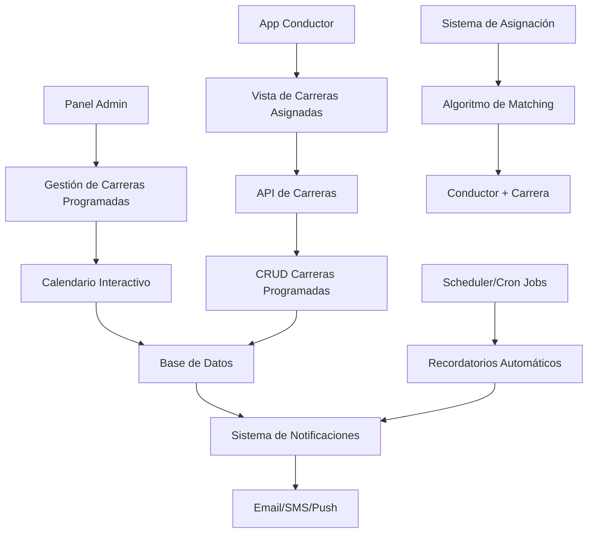

# 📅 PLAN DE IMPLEMENTACIÓN: SISTEMA DE PROGRAMACIÓN DE CARRERAS CON CALENDARIO

## 🎯 **OBJETIVO**
Crear un sistema completo que permita programar carreras para días futuros, gestionar horarios, asignar conductores y 
proporcionar una vista de calendario intuitiva para administradores y dispatchers.

---

## 🔄 **CASOS DE USO PRINCIPALES**

### **Para Administradores/Dispatchers**
- 📅 Programar carreras para días/semanas futuras
- 👀 Vista de calendario con todas las carreras programadas
- 🚗 Asignar conductores específicos a carreras programadas
- ⏰ Gestionar horarios y disponibilidad
- 📊 Ver estadísticas de carreras programadas vs completadas
- 🔔 Recibir notificaciones de carreras próximas

### **Para Conductores**
- 📱 Ver sus carreras programadas del día/semana
- ✅ Confirmar disponibilidad para carreras asignadas
- 🕐 Recibir recordatorios de carreras próximas
- 📍 Navegar a ubicación de recogida programada

### **Para Clientes (Futuro)**
- 🗓️ Solicitar carreras programadas con anticipación
- 📞 Confirmar o cancelar carreras programadas
- 💬 Recibir recordatorios automáticos

---

## 🏗️ **ARQUITECTURA DEL SISTEMA**



---

## 📝 **PLAN DE IMPLEMENTACIÓN PASO A PASO**

### **FASE 1: Estructura de Datos y Backend**

#### 1.1 Modelo de Datos - Carreras Programadas
```typescript
interface ScheduledRide {
  id: string;
  client_id: string;
  driver_id?: string; // Opcional hasta asignar
  pickup_location: string;
  pickup_coordinates: {
    lat: number;
    lng: number;
  };
  destination: string;
  destination_coordinates: {
    lat: number;
    lng: number;
  };
  scheduled_date: string; // ISO 8601
  scheduled_time: string; // HH:MM
  estimated_duration: number; // minutos
  estimated_cost: number;
  status: 'pending' | 'confirmed' | 'assigned' | 'in_progress' | 'completed' | 'cancelled';
  priority: 'low' | 'normal' | 'high' | 'urgent';
  recurring?: {
    type: 'daily' | 'weekly' | 'monthly';
    end_date?: string;
    days_of_week?: number[]; // [1,2,3,4,5] para lunes-viernes
  };
  notes?: string;
  created_at: string;
  updated_at: string;
  created_by: string; // ID del admin/dispatcher
}
```

#### 1.2 API Endpoints Necesarios
```typescript
// Carreras programadas
GET    /api/scheduled-rides           // Listar con filtros
POST   /api/scheduled-rides           // Crear nueva
PUT    /api/scheduled-rides/:id       // Actualizar
DELETE /api/scheduled-rides/:id       // Cancelar

// Calendario
GET    /api/calendar/rides/:date      // Carreras de un día específico
GET    /api/calendar/month/:year/:month // Vista mensual
GET    /api/calendar/week/:date       // Vista semanal

// Asignación de conductores
POST   /api/scheduled-rides/:id/assign   // Asignar conductor
DELETE /api/scheduled-rides/:id/unassign // Desasignar conductor
GET    /api/drivers/available/:date/:time // Conductores disponibles

// Notificaciones
POST   /api/scheduled-rides/:id/notify   // Enviar recordatorio manual
GET    /api/scheduled-rides/upcoming     // Carreras próximas (para notificaciones)
```

#### 1.3 Servicios Backend
```typescript
class ScheduledRideService {
  async createScheduledRide(data: CreateScheduledRideDTO): Promise<ScheduledRide>
  async getScheduledRides(filters: ScheduledRideFilters): Promise<ScheduledRide[]>
  async updateScheduledRide(id: string, data: UpdateScheduledRideDTO): Promise<ScheduledRide>
  async cancelScheduledRide(id: string, reason: string): Promise<void>
  async assignDriver(rideId: string, driverId: string): Promise<void>
  async getCalendarView(startDate: string, endDate: string): Promise<CalendarData>
  async getAvailableDrivers(date: string, time: string): Promise<Driver[]>
  async createRecurringRides(data: RecurringRideDTO): Promise<ScheduledRide[]>
}
```

### **FASE 2: Componentes de Calendario Frontend**

#### 2.1 Estructura de Componentes
```
src/
├── components/
│   └── calendar/
│       ├── CalendarView.tsx           # Vista principal del calendario
│       ├── CalendarGrid.tsx           # Grid mensual/semanal
│       ├── DayView.tsx                # Vista detallada del día
│       ├── RideCard.tsx               # Tarjeta de carrera individual
│       ├── ScheduleRideModal.tsx      # Modal para programar carrera
│       ├── AssignDriverModal.tsx      # Modal para asignar conductor
│       └── RecurringRideModal.tsx     # Modal para carreras recurrentes
├── pages/
│   ├── ScheduledRides.tsx             # Página principal
│   └── CalendarDashboard.tsx          # Dashboard con métricas
└── hooks/
    ├── useScheduledRides.ts           # Hook para gestión de carreras
    ├── useCalendar.ts                 # Hook para lógica del calendario
    └── useDriverAssignment.ts         # Hook para asignación
```

#### 2.2 Componente Principal - CalendarView
```typescript
interface CalendarViewProps {
  view: 'month' | 'week' | 'day';
  currentDate: Date;
  onDateChange: (date: Date) => void;
  onViewChange: (view: CalendarView) => void;
  onRideSelect: (ride: ScheduledRide) => void;
  onCreateRide: (date: Date, time?: string) => void;
}

const CalendarView: React.FC<CalendarViewProps> = ({
  view,
  currentDate,
  onDateChange,
  onViewChange,
  onRideSelect,
  onCreateRide
}) => {
  const { rides, isLoading } = useScheduledRides({
    startDate: getStartOfPeriod(currentDate, view),
    endDate: getEndOfPeriod(currentDate, view)
  });

  return (
    <Box sx={{ height: '100%', display: 'flex', flexDirection: 'column' }}>
      {/* Header con controles */}
      <CalendarHeader 
        view={view}
        currentDate={currentDate}
        onDateChange={onDateChange}
        onViewChange={onViewChange}
        onCreateRide={() => onCreateRide(currentDate)}
      />
      
      {/* Vista del calendario */}
      {view === 'month' && (
        <MonthView 
          rides={rides}
          currentDate={currentDate}
          onRideSelect={onRideSelect}
          onCreateRide={onCreateRide}
        />
      )}
      
      {view === 'week' && (
        <WeekView 
          rides={rides}
          currentDate={currentDate}
          onRideSelect={onRideSelect}
          onCreateRide={onCreateRide}
        />
      )}
      
      {view === 'day' && (
        <DayView 
          rides={rides}
          currentDate={currentDate}
          onRideSelect={onRideSelect}
          onCreateRide={onCreateRide}
        />
      )}
    </Box>
  );
};
```

### **FASE 3: Modal de Programación de Carreras**

#### 3.1 Componente ScheduleRideModal
```typescript
interface ScheduleRideModalProps {
  open: boolean;
  onClose: () => void;
  initialDate?: Date;
  initialTime?: string;
  editingRide?: ScheduledRide;
}

const ScheduleRideModal: React.FC<ScheduleRideModalProps> = ({
  open,
  onClose,
  initialDate,
  initialTime,
  editingRide
}) => {
  const [formData, setFormData] = useState<ScheduledRideForm>({
    pickup_location: '',
    destination: '',
    scheduled_date: initialDate || new Date(),
    scheduled_time: initialTime || '09:00',
    client_phone: '',
    client_name: '',
    priority: 'normal',
    notes: '',
    recurring: false
  });

  return (
    <Dialog open={open} onClose={onClose} maxWidth="md" fullWidth>
      <DialogTitle>
        {editingRide ? 'Editar Carrera Programada' : 'Programar Nueva Carrera'}
      </DialogTitle>
      
      <DialogContent>
        <Box sx={{ display: 'flex', flexDirection: 'column', gap: 3, pt: 2 }}>
          {/* Información del cliente */}
          <Typography variant="h6">Información del Cliente</Typography>
          <Box sx={{ display: 'flex', gap: 2 }}>
            <TextField
              label="Nombre del cliente"
              value={formData.client_name}
              onChange={(e) => setFormData(prev => ({ ...prev, client_name: e.target.value }))}
              fullWidth
            />
            <PhoneNumberInput
              value={formData.client_phone}
              onChange={(value) => setFormData(prev => ({ ...prev, client_phone: value }))}
              label="Teléfono"
            />
          </Box>

          {/* Ubicaciones */}
          <Typography variant="h6">Ubicaciones</Typography>
          <LocationSelector
            label="Ubicación de recogida"
            value={formData.pickup_location}
            onChange={(location, coordinates) => {
              setFormData(prev => ({
                ...prev,
                pickup_location: location,
                pickup_coordinates: coordinates
              }));
            }}
          />
          <LocationSelector
            label="Destino"
            value={formData.destination}
            onChange={(location, coordinates) => {
              setFormData(prev => ({
                ...prev,
                destination: location,
                destination_coordinates: coordinates
              }));
            }}
          />

          {/* Fecha y hora */}
          <Typography variant="h6">Programación</Typography>
          <Box sx={{ display: 'flex', gap: 2 }}>
            <DatePicker
              label="Fecha"
              value={formData.scheduled_date}
              onChange={(date) => setFormData(prev => ({ ...prev, scheduled_date: date }))}
              minDate={new Date()}
            />
            <TimePicker
              label="Hora"
              value={formData.scheduled_time}
              onChange={(time) => setFormData(prev => ({ ...prev, scheduled_time: time }))}
            />
          </Box>

          {/* Opciones adicionales */}
          <Box sx={{ display: 'flex', gap: 2 }}>
            <FormControl fullWidth>
              <InputLabel>Prioridad</InputLabel>
              <Select
                value={formData.priority}
                onChange={(e) => setFormData(prev => ({ ...prev, priority: e.target.value }))}
              >
                <MenuItem value="low">Baja</MenuItem>
                <MenuItem value="normal">Normal</MenuItem>
                <MenuItem value="high">Alta</MenuItem>
                <MenuItem value="urgent">Urgente</MenuItem>
              </Select>
            </FormControl>
            
            <FormControlLabel
              control={
                <Checkbox
                  checked={formData.recurring}
                  onChange={(e) => setFormData(prev => ({ ...prev, recurring: e.target.checked }))}
                />
              }
              label="Carrera recurrente"
            />
          </Box>

          {/* Configuración de recurrencia */}
          {formData.recurring && (
            <RecurringOptions
              value={formData.recurring_config}
              onChange={(config) => setFormData(prev => ({ ...prev, recurring_config: config }))}
            />
          )}

          {/* Notas */}
          <TextField
            label="Notas adicionales"
            value={formData.notes}
            onChange={(e) => setFormData(prev => ({ ...prev, notes: e.target.value }))}
            multiline
            rows={3}
            fullWidth
          />
        </Box>
      </DialogContent>

      <DialogActions>
        <Button onClick={onClose}>Cancelar</Button>
        <Button variant="contained" onClick={handleSubmit}>
          {editingRide ? 'Actualizar' : 'Programar Carrera'}
        </Button>
      </DialogActions>
    </Dialog>
  );
};
```

### **FASE 4: Vistas del Calendario**

#### 4.1 Vista Mensual
```typescript
const MonthView: React.FC<MonthViewProps> = ({ rides, currentDate, onRideSelect, onCreateRide }) => {
  const daysInMonth = getDaysInMonth(currentDate);
  const firstDayOfWeek = getFirstDayOfWeek(currentDate);
  
  return (
    <Box sx={{ flex: 1, display: 'grid', gridTemplateColumns: 'repeat(7, 1fr)', gap: 1 }}>
      {/* Headers de días de la semana */}
      {['Dom', 'Lun', 'Mar', 'Mié', 'Jue', 'Vie', 'Sáb'].map(day => (
        <Typography key={day} variant="subtitle2" sx={{ p: 1, textAlign: 'center', fontWeight: 'bold' }}>
          {day}
        </Typography>
      ))}
      
      {/* Días del mes */}
      {Array.from({ length: 42 }, (_, index) => {
        const dayNumber = index - firstDayOfWeek + 1;
        const isCurrentMonth = dayNumber > 0 && dayNumber <= daysInMonth;
        const currentDay = new Date(currentDate.getFullYear(), currentDate.getMonth(), dayNumber);
        const dayRides = rides.filter(ride => isSameDay(new Date(ride.scheduled_date), currentDay));
        
        return (
          <CalendarDay
            key={index}
            date={currentDay}
            isCurrentMonth={isCurrentMonth}
            rides={dayRides}
            onRideSelect={onRideSelect}
            onCreateRide={onCreateRide}
          />
        );
      })}
    </Box>
  );
};
```

#### 4.2 Vista Semanal
```typescript
const WeekView: React.FC<WeekViewProps> = ({ rides, currentDate, onRideSelect, onCreateRide }) => {
  const weekDays = getWeekDays(currentDate);
  const hours = Array.from({ length: 24 }, (_, i) => i);
  
  return (
    <Box sx={{ flex: 1, display: 'flex', flexDirection: 'column' }}>
      {/* Header con días de la semana */}
      <Box sx={{ display: 'grid', gridTemplateColumns: '60px repeat(7, 1fr)', borderBottom: 1, borderColor: 'divider' }}>
        <Box /> {/* Espacio para columna de horas */}
        {weekDays.map(day => (
          <Box key={day.toISOString()} sx={{ p: 1, textAlign: 'center' }}>
            <Typography variant="subtitle2">{format(day, 'EEE dd')}</Typography>
          </Box>
        ))}
      </Box>
      
      {/* Grid de horas */}
      <Box sx={{ flex: 1, overflow: 'auto' }}>
        {hours.map(hour => (
          <Box key={hour} sx={{ display: 'grid', gridTemplateColumns: '60px repeat(7, 1fr)', minHeight: 60, borderBottom: 1, borderColor: 'divider' }}>
            <Box sx={{ p: 1, borderRight: 1, borderColor: 'divider' }}>
              <Typography variant="caption">{hour.toString().padStart(2, '0')}:00</Typography>
            </Box>
            {weekDays.map(day => {
              const hourRides = rides.filter(ride => {
                const rideDate = new Date(ride.scheduled_date);
                const rideHour = parseInt(ride.scheduled_time.split(':')[0]);
                return isSameDay(rideDate, day) && rideHour === hour;
              });
              
              return (
                <CalendarHourSlot
                  key={`${day.toISOString()}-${hour}`}
                  date={day}
                  hour={hour}
                  rides={hourRides}
                  onRideSelect={onRideSelect}
                  onCreateRide={onCreateRide}
                />
              );
            })}
          </Box>
        ))}
      </Box>
    </Box>
  );
};
```

#### 4.3 Vista Diaria
```typescript
const DayView: React.FC<DayViewProps> = ({ rides, currentDate, onRideSelect, onCreateRide }) => {
  const hours = Array.from({ length: 24 }, (_, i) => i);
  const dayRides = rides.filter(ride => isSameDay(new Date(ride.scheduled_date), currentDate));
  
  return (
    <Box sx={{ flex: 1, display: 'flex' }}>
      {/* Columna de horas */}
      <Box sx={{ width: 80, borderRight: 1, borderColor: 'divider' }}>
        {hours.map(hour => (
          <Box key={hour} sx={{ height: 80, p: 1, borderBottom: 1, borderColor: 'divider' }}>
            <Typography variant="caption">{hour.toString().padStart(2, '0')}:00</Typography>
          </Box>
        ))}
      </Box>
      
      {/* Área de carreras */}
      <Box sx={{ flex: 1, position: 'relative' }}>
        {hours.map(hour => (
          <Box
            key={hour}
            sx={{ height: 80, borderBottom: 1, borderColor: 'divider', position: 'relative' }}
            onClick={() => onCreateRide(currentDate, `${hour.toString().padStart(2, '0')}:00`)}
          >
            {dayRides
              .filter(ride => parseInt(ride.scheduled_time.split(':')[0]) === hour)
              .map(ride => (
                <RideCard
                  key={ride.id}
                  ride={ride}
                  onClick={() => onRideSelect(ride)}
                  style={{
                    position: 'absolute',
                    top: `${parseInt(ride.scheduled_time.split(':')[1]) * 80 / 60}px`,
                    left: 8,
                    right: 8,
                    height: `${ride.estimated_duration * 80 / 60}px`,
                    minHeight: 40
                  }}
                />
              ))}
          </Box>
        ))}
      </Box>
    </Box>
  );
};
```

### **FASE 5: Sistema de Asignación de Conductores**

#### 5.1 Modal de Asignación
```typescript
const AssignDriverModal: React.FC<AssignDriverModalProps> = ({ open, onClose, ride }) => {
  const { data: availableDrivers, isLoading } = useAvailableDrivers(
    ride?.scheduled_date,
    ride?.scheduled_time
  );
  
  const [selectedDriver, setSelectedDriver] = useState<string>('');
  const [autoAssign, setAutoAssign] = useState(false);
  
  const handleAssign = async () => {
    if (autoAssign) {
      await assignDriverAutomatically(ride.id);
    } else {
      await assignDriver(ride.id, selectedDriver);
    }
    onClose();
  };
  
  return (
    <Dialog open={open} onClose={onClose} maxWidth="sm" fullWidth>
      <DialogTitle>Asignar Conductor</DialogTitle>
      
      <DialogContent>
        <Box sx={{ mb: 3 }}>
          <Typography variant="h6">Información de la Carrera</Typography>
          <Typography>📍 {ride?.pickup_location} → {ride?.destination}</Typography>
          <Typography>🕐 {ride?.scheduled_date} a las {ride?.scheduled_time}</Typography>
          <Typography>⏱️ Duración estimada: {ride?.estimated_duration} min</Typography>
        </Box>
        
        <FormControlLabel
          control={
            <Switch
              checked={autoAssign}
              onChange={(e) => setAutoAssign(e.target.checked)}
            />
          }
          label="Asignación automática (mejor conductor disponible)"
        />
        
        {!autoAssign && (
          <Box sx={{ mt: 2 }}>
            <Typography variant="h6" sx={{ mb: 2 }}>Conductores Disponibles</Typography>
            {isLoading ? (
              <CircularProgress />
            ) : (
              <List>
                {availableDrivers?.map(driver => (
                  <ListItem
                    key={driver.id}
                    button
                    selected={selectedDriver === driver.id}
                    onClick={() => setSelectedDriver(driver.id)}
                  >
                    <ListItemAvatar>
                      <Avatar src={driver.profile_picture_url}>
                        <PersonIcon />
                      </Avatar>
                    </ListItemAvatar>
                    <ListItemText
                      primary={`${driver.first_name} ${driver.last_name}`}
                      secondary={
                        <Box>
                          <Typography variant="body2">⭐ {driver.rating || 'N/A'}</Typography>
                          <Typography variant="body2">📍 {driver.distance_km}km de distancia</Typography>
                          <Typography variant="body2">🚗 {driver.vehicle} {driver.model}</Typography>
                        </Box>
                      }
                    />
                  </ListItem>
                ))}
              </List>
            )}
          </Box>
        )}
      </DialogContent>
      
      <DialogActions>
        <Button onClick={onClose}>Cancelar</Button>
        <Button 
          variant="contained" 
          onClick={handleAssign}
          disabled={!autoAssign && !selectedDriver}
        >
          Asignar Conductor
        </Button>
      </DialogActions>
    </Dialog>
  );
};
```

#### 5.2 Algoritmo de Asignación Automática
```typescript
interface DriverScore {
  driver: Driver;
  score: number;
  factors: {
    distance: number;
    rating: number;
    availability: number;
    experience: number;
  };
}

class DriverAssignmentService {
  async findBestDriver(ride: ScheduledRide): Promise<Driver | null> {
    const availableDrivers = await this.getAvailableDrivers(ride.scheduled_date, ride.scheduled_time);
    
    if (availableDrivers.length === 0) return null;
    
    const scoredDrivers = await Promise.all(
      availableDrivers.map(driver => this.scoreDriver(driver, ride))
    );
    
    // Ordenar por score descendente
    scoredDrivers.sort((a, b) => b.score - a.score);
    
    return scoredDrivers[0].driver;
  }
  
  private async scoreDriver(driver: Driver, ride: ScheduledRide): Promise<DriverScore> {
    const factors = {
      distance: this.calculateDistanceScore(driver, ride),
      rating: this.calculateRatingScore(driver),
      availability: this.calculateAvailabilityScore(driver, ride),
      experience: this.calculateExperienceScore(driver)
    };
    
    // Pesos para cada factor
    const weights = {
      distance: 0.4,
      rating: 0.3,
      availability: 0.2,
      experience: 0.1
    };
    
    const score = Object.keys(factors).reduce(
      (total, key) => total + factors[key] * weights[key],
      0
    );
    
    return { driver, score, factors };
  }
  
  private calculateDistanceScore(driver: Driver, ride: ScheduledRide): number {
    const distance = this.calculateDistance(
      driver.current_location,
      ride.pickup_coordinates
    );
    
    // Score inversamente proporcional a la distancia
    // 0km = 100, 10km = 50, 20km+ = 0
    return Math.max(0, 100 - (distance * 5));
  }
  
  private calculateRatingScore(driver: Driver): number {
    const rating = driver.average_rating || 3;
    // Convertir rating de 1-5 a 0-100
    return ((rating - 1) / 4) * 100;
  }
  
  private calculateAvailabilityScore(driver: Driver, ride: ScheduledRide): number {
    // Verificar carreras cercanas en tiempo
    const conflictingRides = this.getDriverRidesNearTime(driver.id, ride.scheduled_date, ride.scheduled_time);
    
    if (conflictingRides.length === 0) return 100;
    if (conflictingRides.length === 1) return 70;
    if (conflictingRides.length === 2) return 40;
    return 0;
  }
  
  private calculateExperienceScore(driver: Driver): number {
    const totalRides = driver.total_rides || 0;
    // Score basado en experiencia
    if (totalRides >= 1000) return 100;
    if (totalRides >= 500) return 80;
    if (totalRides >= 100) return 60;
    if (totalRides >= 50) return 40;
    return 20;
  }
}
```

### **FASE 6: Sistema de Notificaciones**

#### 6.1 Servicio de Notificaciones
```typescript
class ScheduledRideNotificationService {
  async sendRideReminders(): Promise<void> {
    const upcomingRides = await this.getUpcomingRides();
    
    for (const ride of upcomingRides) {
      await this.processRideNotifications(ride);
    }
  }
  
  private async processRideNotifications(ride: ScheduledRide): Promise<void> {
    const now = new Date();
    const rideDateTime = new Date(`${ride.scheduled_date} ${ride.scheduled_time}`);
    const timeDiff = rideDateTime.getTime() - now.getTime();
    const hoursUntilRide = timeDiff / (1000 * 60 * 60);
    
    // Notificaciones escalonadas
    if (hoursUntilRide <= 24 && !ride.notifications?.day_before_sent) {
      await this.sendDayBeforeReminder(ride);
    }
    
    if (hoursUntilRide <= 2 && !ride.notifications?.two_hours_sent) {
      await this.sendTwoHourReminder(ride);
    }
    
    if (hoursUntilRide <= 0.5 && !ride.notifications?.thirty_minutes_sent) {
      await this.sendThirtyMinuteReminder(ride);
    }
  }
  
  private async sendDayBeforeReminder(ride: ScheduledRide): Promise<void> {
    // Notificar al conductor
    if (ride.driver_id) {
      await this.notificationService.send({
        type: 'push',
        recipient: ride.driver_id,
        title: 'Carrera programada para mañana',
        body: `Tienes una carrera programada para mañana a las ${ride.scheduled_time}`,
        data: { ride_id: ride.id, type: 'scheduled_ride_reminder' }
      });
    }
    
    // Notificar al cliente
    await this.notificationService.send({
      type: 'sms',
      recipient: ride.client_phone,
      message: `Recordatorio: Tu carrera está programada para mañana ${ride.scheduled_date} a las ${ride.scheduled_time}. Desde ${ride.pickup_location} hacia ${ride.destination}.`
    });
    
    // Marcar como enviado
    await this.markNotificationSent(ride.id, 'day_before_sent');
  }
  
  private async sendTwoHourReminder(ride: ScheduledRide): Promise<void> {
    if (ride.driver_id) {
      await this.notificationService.send({
        type: 'push',
        recipient: ride.driver_id,
        title: 'Carrera en 2 horas',
        body: `Tu próxima carrera es en 2 horas. Prepárate para salir hacia ${ride.pickup_location}`,
        data: { ride_id: ride.id, type: 'scheduled_ride_soon' }
      });
    }
    
    await this.markNotificationSent(ride.id, 'two_hours_sent');
  }
  
  private async sendThirtyMinuteReminder(ride: ScheduledRide): Promise<void> {
    if (ride.driver_id) {
      await this.notificationService.send({
        type: 'push',
        recipient: ride.driver_id,
        title: '🚨 Carrera en 30 minutos',
        body: `Es hora de dirigirte a ${ride.pickup_location}. El cliente te espera a las ${ride.scheduled_time}`,
        data: { 
          ride_id: ride.id, 
          type: 'scheduled_ride_now',
          action: 'navigate_to_pickup'
        }
      });
    }
    
    // Notificar al cliente también
    await this.notificationService.send({
      type: 'sms',
      recipient: ride.client_phone,
      message: `Tu conductor está en camino. Carrera programada para las ${ride.scheduled_time}. Te contactaremos cuando llegue.`
    });
    
    await this.markNotificationSent(ride.id, 'thirty_minutes_sent');
  }
}
```

#### 6.2 Cron Jobs para Notificaciones
```typescript
// En el backend, configurar trabajos programados
class ScheduledJobsService {
  initializeJobs(): void {
    // Cada 15 minutos, verificar carreras próximas
    cron.schedule('*/15 * * * *', async () => {
      await this.notificationService.sendRideReminders();
    });
    
    // Cada hora, limpiar notificaciones viejas
    cron.schedule('0 * * * *', async () => {
      await this.cleanupOldNotifications();
    });
    
    // Cada día a las 6 AM, generar reporte de carreras del día
    cron.schedule('0 6 * * *', async () => {
      await this.generateDailyRideReport();
    });
    
    // Cada domingo a las 8 PM, generar carreras recurrentes para la próxima semana
    cron.schedule('0 20 * * 0', async () => {
      await this.generateRecurringRides();
    });
  }
}
```

---

## 🎨 **DISEÑO DE INTERFAZ**

### **Página Principal - Calendario**
```
┌─────────────────────────────────────────────────────────────┐
│ 📅 Carreras Programadas                    [+ Nueva Carrera] │
├─────────────────────────────────────────────────────────────┤
│ [Mes] [Semana] [Día]    ← Enero 2024 →    [Hoy] [Filtros]  │
├─────────────────────────────────────────────────────────────┤
│ Dom    Lun    Mar    Mié    Jue    Vie    Sáb              │
│  1      2      3      4      5      6      7               │
│         🚗     🚗🚗           🚗                           │
│                                                             │
│  8      9     10     11     12     13     14               │
│  🚗🚗   🚗    🚗🚗🚗   🚗     🚗🚗    🚗     🚗              │
│                                                             │
│ 15     16     17     18     19     20     21               │
│  🚗     🚗     🚗     🚗🚗    🚗     🚗🚗    🚗              │
└─────────────────────────────────────────────────────────────┘

📊 Estadísticas del Mes:
• Total programadas: 45
• Completadas: 38 (84%)
• Canceladas: 4 (9%)
• Pendientes: 3 (7%)
```

### **Vista Detallada del Día**
```
┌─────────────────────────────────────────────────────────────┐
│ 📅 Lunes, 15 de Enero 2024             [+ Programar Carrera] │
├─────────────────────────────────────────────────────────────┤
│ 06:00 │                                                     │
│ 07:00 │ 🚗 07:30 - Juan Pérez                              │
│       │    📍 Centro → Aeropuerto                           │
│       │    👤 Carlos Rodríguez ✅                           │
│ 08:00 │                                                     │
│ 09:00 │ 🚗 09:15 - María González                          │
│       │    📍 Las Mercedes → CCCT                           │
│       │    👤 Sin asignar ⚠️                               │
│ 10:00 │                                                     │
│ 11:00 │ 🚗 11:00 - Empresa ABC (Recurrente)               │
│       │    📍 Oficina → Reunión Centro                     │
│       │    👤 Ana Martínez ✅                              │
│ 12:00 │                                                     │
└─────────────────────────────────────────────────────────────┘
```

### **Modal de Nueva Carrera**
```
┌─────────────────────────────────────────────────────────────┐
│ ✨ Programar Nueva Carrera                            [✕]   │
├─────────────────────────────────────────────────────────────┤
│                                                             │
│ 👤 Información del Cliente                                  │
│ Nombre: [Juan Carlos Pérez        ]                        │
│ Teléfono: [+58 414-123-4567      ]                        │
│                                                             │
│ 📍 Ubicaciones                                             │
│ Recogida: [Centro Comercial Sambil    ] [📍]              │
│ Destino:  [Aeropuerto Maiquetía       ] [📍]              │
│                                                             │
│ 🕐 Programación                                            │
│ Fecha: [15/01/2024 ▼] Hora: [14:30 ▼]                     │
│ Prioridad: [Normal ▼]                                      │
│                                                             │
│ 🔄 Opciones Avanzadas                                      │
│ ☐ Carrera recurrente                                       │
│ ☐ Asignar conductor automáticamente                        │
│                                                             │
│ 📝 Notas adicionales:                                      │
│ [Vuelo a las 16:00, confirmar 30 min antes]               │
│                                                             │
│                            [Cancelar] [Programar Carrera]  │
└─────────────────────────────────────────────────────────────┘
```

---

## 📊 **MÉTRICAS Y DASHBOARD**

### **KPIs Principales**
```typescript
interface ScheduledRideMetrics {
  // Métricas de programación
  total_scheduled: number;
  scheduled_today: number;
  scheduled_this_week: number;
  scheduled_this_month: number;
  
  // Métricas de cumplimiento
  completion_rate: number; // % de carreras completadas vs programadas
  on_time_rate: number;    // % de carreras que salieron a tiempo
  cancellation_rate: number; // % de carreras canceladas
  
  // Métricas de asignación
  auto_assignment_rate: number; // % de asignaciones automáticas exitosas
  average_assignment_time: number; // Tiempo promedio para asignar conductor
  unassigned_rides: number; // Carreras sin conductor asignado
  
  // Métricas de conductores
  most_scheduled_driver: Driver;
  driver_punctuality: { driver_id: string; on_time_percentage: number }[];
  
  // Métricas de clientes
  recurring_clients: number;
  client_satisfaction: number; // Rating promedio de carreras programadas
  
  // Métricas de tiempo
  peak_hours: { hour: number; ride_count: number }[];
  busiest_days: { day: string; ride_count: number }[];
}
```

### **Dashboard de Métricas**
```typescript
const ScheduledRidesDashboard: React.FC = () => {
  const { data: metrics } = useScheduledRideMetrics();
  
  return (
    <Box sx={{ p: 3 }}>
      <Typography variant="h4" gutterBottom>
        📊 Dashboard de Carreras Programadas
      </Typography>
      
      {/* Métricas principales */}
      <Grid container spacing={3} sx={{ mb: 4 }}>
        <Grid item xs={12} sm={6} md={3}>
          <MetricCard
            title="Programadas Hoy"
            value={metrics?.scheduled_today}
            icon="🚗"
            color="primary"
          />
        </Grid>
        <Grid item xs={12} sm={6} md={3}>
          <MetricCard
            title="Tasa de Cumplimiento"
            value={`${metrics?.completion_rate}%`}
            icon="✅"
            color="success"
          />
        </Grid>
        <Grid item xs={12} sm={6} md={3}>
          <MetricCard
            title="Puntualidad"
            value={`${metrics?.on_time_rate}%`}
            icon="⏰"
            color="info"
          />
        </Grid>
        <Grid item xs={12} sm={6} md={3}>
          <MetricCard
            title="Sin Asignar"
            value={metrics?.unassigned_rides}
            icon="⚠️"
            color="warning"
          />
        </Grid>
      </Grid>
      
      {/* Gráficos */}
      <Grid container spacing={3}>
        <Grid item xs={12} md={6}>
          <Paper sx={{ p: 3 }}>
            <Typography variant="h6" gutterBottom>
              Carreras por Hora del Día
            </Typography>
            <BarChart data={metrics?.peak_hours} />
          </Paper>
        </Grid>
        <Grid item xs={12} md={6}>
          <Paper sx={{ p: 3 }}>
            <Typography variant="h6" gutterBottom>
              Tendencia Semanal
            </Typography>
            <LineChart data={metrics?.weekly_trend} />
          </Paper>
        </Grid>
      </Grid>
    </Box>
  );
};
```

---

## 🔮 **FUTURAS MEJORAS**

### **Fase 2: Funcionalidades Avanzadas**
- 🤖 **IA Predictiva**: Sugerir horarios óptimos basados en patrones históricos
- 🗺️ **Optimización de Rutas**: Agrupar carreras cercanas para eficiencia
- 💰 **Precios Dinámicos**: Ajustar tarifas según demanda programada
- 📱 **App Cliente**: Permitir a clientes programar sus propias carreras

### **Fase 3: Integración Empresarial**
- 🏢 **API para Empresas**: Integración con sistemas corporativos
- 📊 **Business Intelligence**: Dashboard avanzado con analytics
- 🔗 **Integración con Calendario**: Sincronizar con Google Calendar, Outlook
- 🎯 **Segmentación de Clientes**: Diferentes tipos de servicio por cliente

---

## 🛠️ **CONSIDERACIONES TÉCNICAS**

### **Performance**
- Paginación inteligente para calendarios con muchas carreras
- Cache de vistas de calendario frecuentemente consultadas
- Lazy loading de componentes pesados
- Optimización de consultas a base de datos

### **Escalabilidad**
- Arquitectura de microservicios para notificaciones
- Queue system para procesamiento de carreras masivas
- Sharding de base de datos por fecha
- CDN para assets estáticos del calendario

### **Seguridad**
- Validación de permisos por rol (admin, dispatcher, conductor)
- Encriptación de datos sensibles de clientes
- Logs de auditoría para cambios en carreras programadas
- Rate limiting en APIs públicas

---

## 📋 **CHECKLIST DE IMPLEMENTACIÓN**

### **Backend**
- [ ] Crear modelos de datos para carreras programadas
- [ ] Implementar API endpoints CRUD
- [ ] Configurar sistema de notificaciones
- [ ] Crear algoritmo de asignación automática
- [ ] Implementar cron jobs para recordatorios
- [ ] Configurar sistema de métricas

### **Frontend**
- [ ] Crear componentes de calendario (mes/semana/día)
- [ ] Implementar modal de programación de carreras
- [ ] Desarrollar sistema de asignación de conductores
- [ ] Crear dashboard de métricas
- [ ] Implementar notificaciones en tiempo real
- [ ] Agregar funcionalidad de carreras recurrentes

### **Testing**
- [ ] Unit tests para lógica de calendario
- [ ] Integration tests para API de carreras programadas
- [ ] E2E tests para flujo completo de programación
- [ ] Performance tests con alta carga de carreras
- [ ] Testing de notificaciones en diferentes dispositivos

### **Documentación**
- [ ] Documentar API endpoints
- [ ] Crear manual de usuario para dispatchers
- [ ] Documentar algoritmo de asignación
- [ ] Guía de configuración de notificaciones

---

*Documento creado: [Fecha actual]*  
*Última actualización: [Fecha de modificación]*  
*Versión: 1.0* 